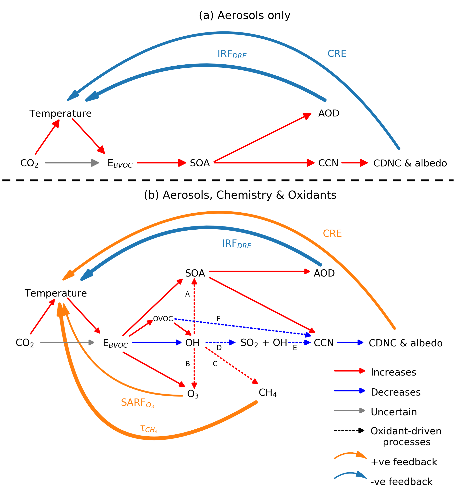

# Publications

[Back to Home](./)

### First Author

#### 1. Improvements to the representation of BVOC chemistry–climate interactions in UKCA (v11.5) with the CRI-Strat 2 mechanism: incorporation and evaluation (Geoscientific Model Development, 2021)

This paper presents the incoporation and evaluation of the CRI-Strat 2 (CS2) chemistry scheme in UKCA. We compare model performance using CS2 with other mechanisms in UKCA against observational datasets and, through sensitivity tests, isolate the impact of the changes to the chemistry of isoprene, O(1 D), inorganic nitrogen and RO2+NO reactions. View [here](https://gmd.copernicus.org/articles/14/5239/2021/).

  
  

  

  Change in boundary layer OH when chemical mechanism is updated from CRI-Strat (CS) to CRI-Strat 2 (CS2).

#### 2. CRI-HOM: A novel chemical mechanism for simulating highly oxygenated organic molecules (HOMs) in global chemistry–aerosol–climate models. (Atmospheric Chemistry and Physics, 2020)

We present one of the first schemes to describe the chemistry of highly oxygenated organic molcules (HOMs) formation from monoterpenes suitable for use in global climate models. View [here](https://acp.copernicus.org/articles/20/10889/2020)

  
  

  

  New oxidation scheme of alpha-pinene by ozone in CRI-HOM.  

#### 3. Minimal climate impacts from short‐lived climate forcers following emission reductions related to the COVID‐19 pandemic (Geophysical Review Letters, 2020)

In UKESM we simulate emission reductions similar to those from the COVID19 pandemic and find that changes in short lived climate forcers such as SO2, NOx, O3 and black carbon aerosol have a minimal impact on climate. View [here](https://agupubs.onlinelibrary.wiley.com/doi/epdf/10.1029/2020GL090326)

## In Prep
### Chemistry-driven oxidant changes strongly influence climate forcing from vegetation emissions. (Nature Geoscience)

  
  

  

  

### Updates to Isoprene and Terpene Emission Factors for the Interactive BVOC Emission Scheme (iBVOC) in the United Kingdom Earth System Model (UKESM)
More information [here](#ef).
